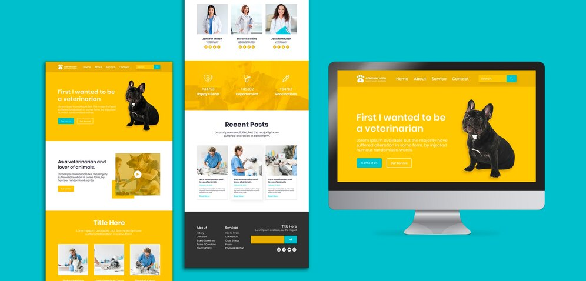

# Clínica Veterinária

Este projeto foi desenvolvido com o objetivo de aplicar os conhecimentos adquiridos durante meus estudos.

## Objetivos do Projeto

- Colocar em prática conceitos de HTML, CSS.
- Criar um portfólio baseado no design da comunidade do Freepik.

### Funcionalidades

O projeto possui as seguintes funcionalidades:

- Página inicial com informações e links para seções do portfólio.
- Seções dedicadas a projetos, habilidades, experiência e contato.

*Obs: Ainda será implementado a resposividade do projeto.*

### Guia de instalação

1. Clone este repositório.
2. Abra o arquivo `index.html` no seu navegador.

## Tecnologias usadas:

## Autores

* *Frontend do projeto* - [@Philippe Mesquita](https://github.com/philippemesquita)
* *Desingner* - <a href="http://www.freepik.com">Desenvolvido por Freepik</a>

## Licença

Esse projeto está sob a licença MIT - acesse os detalhes [LICENSE.md](https://github.com/philippemesquita/Nexcent/blob/main/LICENSE).